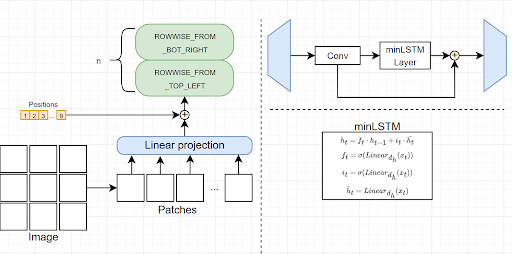

# Vision-minLSTM

[[`Models`](https://github.com/PikaBeka/vision-lstm/releases/tag/models)] 

Pytorch implementation and trained models of Vision-minLSTM, an adaption of minLSTM to computer vision. The code was forked from the [['vision-xLSTM'](https://github.com/NX-AI/vision-lstm)]

# Get started

This code-base supports simple usage of Vision-LSTM with an "architecture-only" implementation and also a full training pipeline on the CIFAR10 dataset.

The codes used for training, testing and evalutation are:
1. cifar10_train.py: code used for training visionXLSTM, visionMinLSTM, ViT, ViM on CIFAR10. Uncomment models to select the model you want to train.
2. cifar_train.py: code used for training on CIFAR100.
3. cifar_resnet.py: code used for training of ResNet-18 on CIFAR10
4. cifar_time.py": code used for calculating the time of models on validation set

The model architecture implementations are stored in vision_lstm directory. Our implementation of minLSTM is in vision_minlsmt.pt file.

Other codes are left after forking from the original github, and they are not used for our project.
